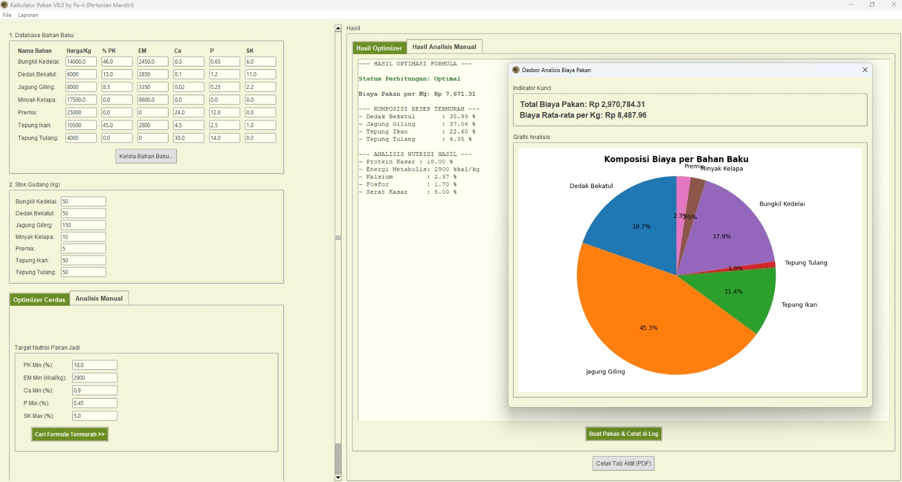

# Kalkulator Pakan Cerdas - Pa-Ri Pertanian Mandiri

**Sebuah aplikasi desktop yang dikembangkan oleh Pari untuk membantu peternak meracik pakan ternak secara efisien dan cerdas.**

Aplikasi ini berevolusi dari kalkulator sederhana menjadi sebuah platform formulasi pakan lengkap yang mampu memberikan rekomendasi resep termurah berdasarkan target nutrisi.


*Tampilan dashboard.*

---

## Fitur Utama 🚀

* **Formulator Cerdas (Optimizer)**: Secara otomatis menciptakan resep pakan dengan biaya terendah berdasarkan target nutrisi (Protein, Energi, Kalsium, dll.) yang Anda tentukan.
* **Database Dinamis**: Tambah, edit, dan hapus bahan baku atau resep formula langsung dari antarmuka aplikasi.
* **Manajemen Inventaris**: Lacak stok bahan baku di gudang dan dapatkan notifikasi bahan apa saja yang perlu dibeli.
* **Analisis Manual**: Analisis resep pakan yang sudah ada untuk berbagai fase pertumbuhan (Starter, Grower, Finisher).
* **Buku Catatan Digital & Dasbor**: Secara otomatis mencatat setiap aktivitas pembuatan pakan dan menampilkannya dalam bentuk dasbor analisis visual untuk melacak biaya.
* **Laporan PDF Profesional**: Cetak hasil analisis atau resep pakan ke dalam format PDF lengkap dengan logo dan tanggal.
* **Antarmuka Personal**: Simpan dan muat sesi kerja, serta tema warna yang terinspirasi dari logo "Pa-Ri".

---

## Teknologi yang Digunakan

* **Bahasa**: Python 3
* **Antarmuka (GUI)**: Tkinter (ttk)
* **Optimasi**: PuLP (untuk Pemrograman Linier)
* **Analisis Data & Grafik**: Pandas & Matplotlib
* **Lainnya**: FPDF2 (untuk PDF), Pillow (untuk gambar)

---

## Cara Instalasi dan Menjalankan

1.  **Clone Repositori**
    ```bash
    git clone https://github.com/agung135/kalkulatorpakan
    cd kalkulatorpakan
    ```

2.  **Buat dan Aktifkan Virtual Environment**
    ```bash
    # Membuat venv
    python -m venv venv
    # Mengaktifkan venv di Windows
    .\venv\Scripts\activate
    ```

3.  **Instal Semua Kebutuhan**
    Gunakan file `requirements.txt` yang sudah disediakan.
    ```bash
    python -m pip install -r requirements.txt
    ```

4.  **Jalankan Aplikasi**
    File utama untuk menjalankan program adalah `main.py`.
    ```bash
    python main.py
    ```
    
---

## Struktur File

* `main.py`: Titik masuk utama untuk menjalankan aplikasi.
* `app_gui.py`: Kelas utama yang membangun dan mengelola seluruh antarmuka aplikasi.
* `optimizer.py`: "Mesin cerdas" yang berisi logika optimasi biaya.
* `config.py`: Menyimpan semua data default dan konfigurasi statis.
* `data_manager.py`: Mengelola semua operasi baca/tulis ke file (JSON, PDF, Log).
* `gui_windows.py`: Mendefinisikan kelas untuk jendela-jendela pop-up.
* `gui_dashboard.py`: Mendefinisikan kelas untuk jendela dasbor analisis.

---


Dibuat dengan ❤️ oleh **Pari**.


